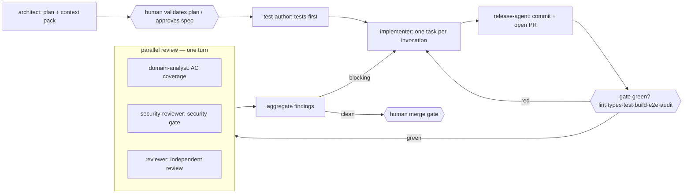

Run the Day-1 implementation cycle for the spec at: $ARGUMENTS

Two roles, seven agents (`architect`, `test-author`, `implementer`, `release-agent`, `domain-analyst`, `security-reviewer`, `reviewer`), full verification gate. This is Spec-Driven Development (CLAUDE.md): the spec is the source of truth, and code follows it. Stop for human input at two points and never merge. The Developer half runs as three **bounded, fresh-context phases**, each a separate subagent invocation handed off by a compact written artifact (validated plan, task/test list, diff summary, last gate output) rather than the full prior transcript.

**Precondition — the approval gate (CLAUDE.md Rule 3).** The spec's `Status` must be `approved` before any code is written. If it is still `draft`, stop after step 1 and ask me to approve it; only I move a spec `draft` → `approved`.

1. **Plan (Architect).** `architect` reconciles the spec against the repo (`server/`, `client/`, `docs/adr/`), enumerates trade-offs (flag ADR-worthy decisions for `docs/adr/`), and produces the task graph, per-task checklist (from the spec's Acceptance criteria), and learning-test list (one per Acceptance-criteria item and per Behaviour scenario). `architect` also emits the **context pack** (files to touch, entrypoints, key symbols/Drizzle tables, existing test locations, the CLAUDE.md invariants at stake) — written into the plan artifact so the Developer phases and review pass don't re-discover the repo. **Pause — show me the plan, trade-offs, and all `TODO: confirm` items before any code.** If the spec is still `draft`, do not proceed to code until I approve it.
2. **Tests first (Developer).** `test-author` reads the plan's context pack and works from it — discovery is the exception, not the opening move. Writes red vitest unit tests (colocated `*.test.ts`/`*.test.tsx`/`*.spec.ts`) + Playwright e2e (`e2e/**/*.spec.ts`, reusing `e2e/pages/` + `e2e/fixtures/`) for every Behaviour scenario in the plan. Confirm they fail for the right reason.
3. **Implement (Developer).** You (the orchestrator) own **one shared task branch** (never `main`); every task's invocation works in it so the diff accumulates. Loop over the task graph in dependency order, invoking `implementer` **once per task, each a fresh context** handed only a compact per-task handoff (task spec slice + its red tests, the shared branch, modules to reuse, one-line summary of prior files touched) — never the prior transcript. After each task, confirm **that task's own tests** are green locally (`npm test -- <path>`) before the next task (a task with no dedicated test gates on `npm run typecheck` + lint + no regression). The full gate runs **once, after the last task**. Honour the CLAUDE.md invariants throughout (thin handlers, services-only logic, `{ data, error }` envelope, Drizzle-only + migration on schema change, portable core free of `node:*`, `// spec:` comments). If a task hits its iteration cap without going green, **halt the loop** and route its compact result back to `test-author`/me. Never edit a test to pass; a spec gap is a spec defect (Rule 4), not a silent patch.
4. **Commit + open PR (Developer).** `release-agent` commits `implementer`'s green diff and opens the PR referencing the spec path (and milestone) — it does not redo `implementer`'s edits. Set the spec's `Status` to `implemented`. Trigger the gate: `npm run lint` · `npm run typecheck` · `npm test` · `npm run build` · Playwright `npm run test:e2e` · `npm audit`. On red, route back to `implementer` (repeat from step 3); do not proceed to step 5 until green.
5. **Review — parallel.** On green CI, spawn in a **single turn** three independent, read-only passes over the same committed diff — do not run them one after another: `domain-analyst` (→ AC-coverage checklist), `security-reviewer` (→ security gate verdict, new high/critical blocks), `reviewer` (independent read — right thing built, architecture fit, test quality → merge recommendation). Wait for all three to finish before continuing.
6. **Aggregate + single fix pass.** Combine all findings from the three passes into one list. If anything blocks (an unmet Acceptance-criteria item, a new high/critical security finding, or a reviewer change request), route the aggregated list back to `implementer` for **one consolidated fix pass** — not three separate round-trips — then repeat from step 4. A failure in any one of the three still blocks merge; this step only changes the sequencing, not the bar.
7. **Stop.** Present the merge recommendation, the AC-coverage checklist, the security verdict, and CI status to me for the merge decision — I merge, not you. Confirm the spec `Status` is `implemented` and note any `docs/sdd-learnings.md` observation worth recording.

**Design rationale.** The three read-only passes fan out concurrently and findings are aggregated once before a single fix pass, instead of a serial review chain. The monolithic build role is split into three bounded, fresh-context phases (`test-author`/`implementer`/`release-agent`), each handed off via a compact written artifact instead of the full prior transcript, and the implement phase is bounded to one fresh `implementer` invocation per task (plus read-once/patch-once editing) — this is the main lever against re-transmitting the same repo reads across every downstream call.
